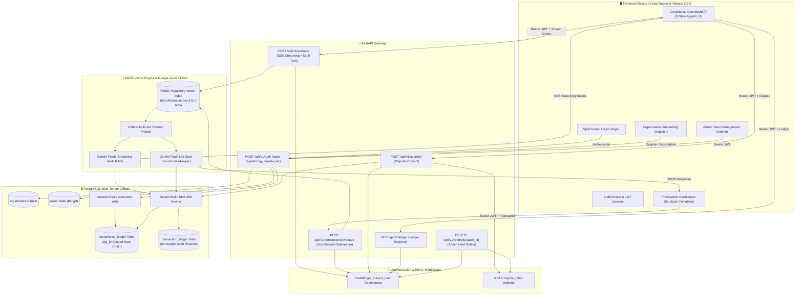

# ⚖️ FinSight — AI-Powered RegTech Compliance Gatekeeper & Transaction Sandbox

[](https://fastapi.tiangolo.com)
[](https://nextjs.org)
[](#-multi-tenancy--rbac-architecture)
[](#-rbac-permission-matrix)
[-0A85EA?style=flat)](https://github.com/facebookresearch/faiss)
[](https://aistudio.google.com)
[](https://www.postgresql.org)
[](https://www.docker.com)
[](#-license--copyright)

**FinSight** is an enterprise-grade Regulatory Technology (RegTech) platform, multi-turn AI compliance auditor, and real-time transaction gatekeeper built for modern B2B fintech ecosystems. 

It evaluates software architectures, tokenization mechanisms, payment rails, and transactional data flows against **8 European Union Regulatory Frameworks** (**EU AI Act 2024/1689**, **GDPR 2016/679**, **PSD2 RTS 2015/2366**, **MiCA 2023/1114**, **TFR Travel Rule 2023/1113**, **DORA 2022/2554**, **AMLD6 2018/1673**, and **AMLD5 2018/843**), sealing every audit determination into an immutable, cryptographic **SHA-256 PostgreSQL ledger** with tenant isolation and Role-Based Access Control (RBAC).

---

## 🏛️ Key Capabilities & Features

### 1. 🤖 3-State Agentic Auditing & Multi-Turn Memory
* **Multi-Turn Conversational Thread**: Full conversational memory across multiple evaluation turns, allowing architects to provide iterative operational clarifications.
* **Selectable Evaluation Modes**:
  * 🛡️ **Auditor Mode (Strict)**: 3-state evaluation matrix across all 8 EU acts with `Pending Clarification` routing when operational controls are underspecified.
  * ⚡ **Demo Mode (Lenient)**: Scope-limited evaluation focusing only on explicitly stated mechanisms.
* **3-State Decision Badge Matrix**:
  * 🟢 **Compliant Architecture** (`is_compliant=True`, `Minimal Risk`): All statutory technical requirements verified and satisfied.
  * ⏳ **Pending Clarification** (`is_compliant=False`, `Pending Clarification`): Actionable technical and operational inquiries returned before final judgment.
  * 🔴 **Action Required / High-Risk** (`is_compliant=False`, `High-Risk` / `Prohibited`): Active statutory breaches or prohibited classifications.

### 2. ⚡ Real-Time FAISS Regulatory Transaction Gatekeeper
* **Machine-to-Machine Sub-Second Screening**: Real-time evaluation of inbound financial transfers against AML/Sanctions rules, Travel Rule thresholds, and PSD2 SCA mandates.
* **Zero-Trust PII Scrubbing**: Redacts sensitive originator/beneficiary personal names and IBANs while preserving routing parameters, amounts, and jurisdictions.
* **Instant Sanctions Fast-Path**: 0ms bypass for international sanctions embargoes (`KP`, `IR`, `SY`).
* **Interactive Live Simulator (`/simulator`)**: Web sandbox to dispatch test transactions (routine SEPA, offshore wires, sanctioned entities) and inspect live ingress vs. scrubbed payloads.

### 3. 📚 Grounded Statutory Citations (8 EU Frameworks)
* Unified **615-article FAISS vector store** covering all key EU Fintech & AI Acts.
* Grounded citations extracted per turn with exact statutory document names, article numbers, and quoted legal excerpts.
* Rendered via interactive collapsible `<details>` and `<summary>` accordions in both the main dashboard and simulator.

### 4. 🏢 B2B Multi-Tenancy, Genesis Blocks & SHA-256 Ledger
* **Tenant Hash Isolation**: Every registered organization receives a cryptographic **Genesis Block (`#0`, `prev_hash = "0"*64`)** from which all subsequent audit records chain deterministically.
* **PostgreSQL Cryptographic Ledger Explorer Modal**: Elevated Apple Liquid Glass modal with truncated hashes (`8...8`), one-click clipboard copy, human-readable timestamps, and full cryptographic hash chain verification.
* **🧑‍⚖️ Human-in-the-Loop Dispute Protocol**: Compliance managers and admins can dispute AI determinations by appending immutable override blocks (`OVERRIDDEN_BY_HUMAN`) without breaking chain continuity.

### 5. 🔐 Role-Based Access Control (RBAC) & Security
* Three strict permission tiers: `MASTER_ADMIN`, `MANAGER`, and `DEVELOPER`.
* Developer roles can run evaluations and view ledger records but are strictly prohibited from dispute overrides and team management.
* Admin Hard Deletion: Route `DELETE /api/v1/prompts/{audit_id}` allows admins to delete test prompts and audit records for privacy hygiene.

---

## 🇪🇺 Comprehensive 8 EU Regulatory Catalog

FinSight's automated SPARQL ingestion and embedding pipeline (`eur_lex_fetcher.py` and `legal_embedder.py`) indexes the full statutory text of 8 core European regulations:

| Acronym | Official EU Regulation / Directive | CELEX Identifier | Scope / Primary Focus |
| :--- | :--- | :--- | :--- |
| **EU AI ACT** | Regulation (EU) 2024/1689 | `32024R1689` | AI Risk Tiers, Prohibited Practices, High-Risk Conformance |
| **GDPR** | Regulation (EU) 2016/679 | `32016R0679` | Data Protection, DPIA, Cross-Border Transfer Safeguards |
| **MiCA** | Regulation (EU) 2023/1114 | `32023R1114` | Crypto-Asset Service Providers (CASP), Asset-Referenced & E-Money Tokens |
| **PSD2** | Directive (EU) 2015/2366 | `32015L2366` | Payment Services Directive, Strong Customer Authentication (SCA), PISP/AISP |
| **TFR** | Regulation (EU) 2023/1113 | `32023R1113` | Transfer of Funds Regulation (Crypto Travel Rule $\ge$ €1,000) |
| **DORA** | Regulation (EU) 2022/2554 | `32022R2554` | Digital Operational Resilience Act, ICT Risk Management, Threat Testing |
| **AMLD6** | Directive (EU) 2018/1673 | `32018L1673` | 6th Anti-Money Laundering Directive (Criminal Penalties & Sanctions) |
| **AMLD5** | Directive (EU) 2018/843 | `32018L0843` | 5th Anti-Money Laundering Directive (Customer Due Diligence & Thresholds) |

---

## 🔐 RBAC Permission Matrix

| Operation / Capability | Endpoint / Route | `MASTER_ADMIN` | `MANAGER` | `DEVELOPER` |
| :--- | :--- | :---: | :---: | :---: |
| **Register New Organization & Genesis Block** | `POST /api/v1/auth/register-org` | ✅ | ❌ | ❌ |
| **Provision Team Users (`DEV` / `MGR`)** | `POST /api/v1/auth/create-user` | ✅ | ❌ | ❌ |
| **Admin Team Management Page** | Next.js `/admin` Route | ✅ | ❌ | ❌ |
| **View Organization Team Members** | `GET /api/v1/auth/users` | ✅ | ✅ | ❌ |
| **Run Streaming Compliance Audits** | `POST /api/v1/evaluate` | ✅ | ✅ | ✅ |
| **Evaluate Transaction Gatekeeper** | `POST /api/v1/transactions/evaluate` | ✅ | ✅ | ✅ |
| **View Ledger Explorer & History** | `GET /api/v1/ledger` | ✅ | ✅ | ✅ |
| **Execute Human Dispute Override** | `POST /api/v1/override` | ✅ | ✅ | 🚫 *(HTTP 403 / Hidden in UI)* |
| **Purge Sandbox Transaction Ledger** | `DELETE /api/v1/transactions/sandbox` | ✅ | ❌ | ❌ |
| **Hard-Delete Audit Prompt** | `DELETE /api/v1/prompts/{audit_id}` | ✅ | ❌ | ❌ |

---

## 🏗️ Architecture & Multi-Tenant Data Flow



---

## 📂 Project Structure

```text
FinSight/
├── backend/
│   ├── data/
│   │   ├── faiss_index/             # Unified 615-article FAISS vector store (index.faiss, index.pkl)
│   │   └── raw_statutes/            # Clean downloaded statutory text for 8 EU Acts
│   ├── src/
│   │   ├── api/
│   │   │   ├── auth.py              # Auth endpoints (/register-org, /login, /create-user, /users)
│   │   │   ├── main.py              # FastAPI app definition, CORS, security headers, lifespan
│   │   │   ├── prompts.py           # Admin prompt management & hard-deletion endpoints
│   │   │   ├── routes.py            # Multi-turn SSE evaluation, dispute override, and scan routes
│   │   │   └── transactions.py      # Real-time transaction gatekeeper API & sandbox purge
│   │   ├── core/
│   │   │   ├── auth.py              # Bcrypt hashing, JWT generation/decoding, RBAC dependencies
│   │   │   ├── database.py          # PostgreSQL multi-tenant DDL (organizations, users, ledger)
│   │   │   ├── ledger.py            # Multi-tenant SHA-256 hash chaining & Genesis block
│   │   │   ├── limiter.py           # SlowAPI rate limiting configuration
│   │   │   ├── llm.py               # Singleton Gemini Flash LLM client
│   │   │   ├── models.py            # SQLAlchemy database models
│   │   │   └── rag.py               # 3-State agentic RAG evaluation, SSE stream, and FAISS index
│   │   ├── schemas/
│   │   │   └── transaction.py       # Pydantic schemas for TransactionPayload and EvaluationResult
│   │   └── services/
│   │       ├── data_ingestion/
│   │       │   ├── eur_lex_fetcher.py # SPARQL EUR-Lex fetcher for 8 EU Acts
│   │       │   └── legal_embedder.py  # Chunking & FAISS index generation
│   │       └── transactions.py      # Sub-second transaction compliance & zero-trust PII engine
│   ├── Dockerfile                   # Python 3.13 + CPU-only PyTorch container
│   └── requirements.txt             # Backend dependencies
├── frontend/
│   ├── app/
│   │   ├── admin/
│   │   │   └── page.tsx             # Protected Admin Team Management & user provisioning
│   │   ├── context/
│   │   │   └── AuthContext.tsx      # React AuthContext & persistent localStorage JWT store
│   │   ├── login/
│   │   │   └── page.tsx             # 50/50 Split-Screen Login UI
│   │   ├── register/
│   │   │   └── page.tsx             # Organization Onboarding & Genesis Block registration
│   │   ├── simulator/
│   │   │   └── page.tsx             # Real-time Transaction Gatekeeper Simulator & Zero-Trust Sandbox
│   │   ├── globals.css              # Tailwind CSS v4 imports and custom scrollbar utilities
│   │   ├── layout.tsx               # Root Next.js layout wrapped in AuthProvider
│   │   └── page.tsx                 # Main Compliance Dashboard with 3-State badge & collapsible citations
│   ├── Dockerfile                   # Node.js 20 container definition
│   ├── package.json                 # Next.js 16, React 19, ReactMarkdown dependencies
│   └── tsconfig.json                # Strict TypeScript configuration
├── .env.example                     # Environment configuration template
├── .gitignore                       # Production git ignore configuration
└── docker-compose.yml               # Multi-container orchestration (Postgres, API, Frontend)
```

---

## 🚀 Quickstart Guide

### Prerequisites

* [Docker Desktop](https://www.docker.com/products/docker-desktop/) (Docker Compose v2+)
* [Google Gemini API Key](https://aistudio.google.com/)

---

### Option 1: One-Click Launch with Docker Compose (Recommended)

1. **Clone the Repository**:
   ```bash
   git clone https://github.com/your-username/FinSight.git
   cd FinSight
   ```

2. **Configure Environment Variables**:
   Create a `.env` file in the root directory:
   ```bash
   cp .env.example .env
   ```
   Set your actual credentials:
   ```env
   GOOGLE_API_KEY=your_actual_gemini_api_key
   GEMINI_MODEL=gemini-3.6-flash
   GEMINI_TRANSACTION_MODEL=gemini-flash-lite-latest
   JWT_SECRET_KEY=your-super-secure-cryptographic-jwt-secret-key-2026
   POSTGRES_DB=finsight_db
   POSTGRES_USER=postgres
   POSTGRES_PASSWORD=postgres
   POSTGRES_HOST=db
   POSTGRES_PORT=5432
   NEXT_PUBLIC_API_URL=http://localhost:8000
   ```

3. **Start All Services**:
   ```bash
   docker compose up --build
   ```

4. **Access the Applications**:
   * 🖥️ **Compliance Dashboard**: [http://localhost:3000](http://localhost:3000)
   * ⚡ **Transaction Gatekeeper Simulator**: [http://localhost:3000/simulator](http://localhost:3000/simulator)
   * 🏢 **Register Organization**: [http://localhost:3000/register](http://localhost:3000/register)
   * 📜 **FastAPI Interactive Docs**: [http://localhost:8000/docs](http://localhost:8000/docs)
   * 🗄️ **PostgreSQL Ledger**: `localhost:5432`

---

### Option 2: Local Development Setup (Manual)

#### 1. Start PostgreSQL
```bash
docker run -d --name finsight_postgres \
  -e POSTGRES_DB=finsight_db \
  -e POSTGRES_USER=postgres \
  -e POSTGRES_PASSWORD=postgres \
  -p 5432:5432 postgres:16-alpine
```

#### 2. Start the FastAPI Backend
```bash
cd backend
python -m venv .venv
source .venv/bin/activate  # On Windows: .venv\Scripts\activate

# Install CPU-only PyTorch first
pip install torch --index-url https://download.pytorch.org/whl/cpu
pip install -r requirements.txt

# (Optional) Rebuild FAISS index from 8 EU Acts
python src/services/data_ingestion/eur_lex_fetcher.py
python src/services/data_ingestion/legal_embedder.py

# Start backend server
uvicorn src.api.main:app --host 0.0.0.0 --port 8000 --reload
```

#### 3. Start the Next.js Frontend
```bash
cd frontend
npm install
npm run dev
```

Open [http://localhost:3000](http://localhost:3000) in your browser.

---

## 📡 RESTful API Reference

All protected endpoints require the header: `Authorization: Bearer <JWT_TOKEN>`.

### 1. Authentication Endpoints

#### `POST /api/v1/auth/register-org` — Register Organization & Genesis Block
* **Request Body**:
  ```json
  {
    "org_name": "Nordic Payments AB",
    "admin_email": "admin@nordicpayments.se",
    "password": "SecureAdminPassword2026!"
  }
  ```
* **Response (HTTP 201)**: Returns access token, user profile, and cryptographic Genesis Block (`#0`).

#### `POST /api/v1/auth/login` — User Authentication
* **Request Body**: `{"email": "...", "password": "..."}`
* **Response (HTTP 200)**: Returns signed JWT access token and user metadata.

#### `POST /api/v1/auth/create-user` — Provision Team Member (`MASTER_ADMIN` only)
* **Request Body**: `{"email": "dev@nordicpayments.se", "password": "...", "role": "DEVELOPER"}`

---

### 2. Multi-Turn Compliance Engine

#### `POST /api/v1/evaluate` — Stream Multi-Turn Compliance Evaluation (SSE)
* **Request Body**:
  ```json
  {
    "query": "We are issuing an EMT token pegged to EUR with 100% reserve bank deposits in French credit institutions...",
    "jurisdictions": ["EU (AI Act, GDPR, PSD2)"],
    "history": [
      {"role": "user", "content": "Initial proposal..."},
      {"role": "assistant", "content": "Previous evaluation report..."}
    ],
    "mode": "strict"
  }
  ```
* **Response**: `text/event-stream` delivering real-time tokens, grounded citations, and SHA-256 ledger confirmation.

#### `POST /api/v1/override` — Human Dispute Override Protocol (`MANAGER` / `MASTER_ADMIN`)
* **Request Body**:
  ```json
  {
    "audit_id": "7b8f9e...",
    "justification": "Processing falls strictly under GDPR Art. 9(2)(a) explicit consent with localized on-device processing."
  }
  ```
* **Response (HTTP 200)**: Appends immutable dispute block (`OVERRIDDEN_BY_HUMAN`) to the organization's hash chain.

---

### 3. Real-Time Transaction Gatekeeper

#### `POST /api/v1/transactions/evaluate` — Sub-Second Transaction Compliance
* **Request Body**:
  ```json
  {
    "transaction_id": "TX-2026-948172",
    "amount": 2450.00,
    "currency": "EUR",
    "originator_country": "FR",
    "beneficiary_country": "FR",
    "payment_method": "SEPA_INSTANT",
    "sca_authenticated": true,
    "asset_type": "FIAT"
  }
  ```
* **Response (HTTP 200)**:
  ```json
  {
    "transaction_id": "TX-2026-948172",
    "verdict": "APPROVED",
    "risk_score": 0.05,
    "is_compliant": true,
    "primary_violations": [],
    "applicable_regulations": ["PSD2 Art. 97", "AMLD6"],
    "audit_rationale": "Transfer is fully compliant with EU statutory regulations as SCA is authenticated and amount is valid.",
    "citations": [
      {
        "document": "PSD2 Directive (EU) 2015/2366",
        "page": "Article 97",
        "quoted_text": "Payment service providers shall apply strong customer authentication where the payer initiates an electronic payment transaction."
      }
    ],
    "sha256_audit_hash": "e3b0c44298fc1c149afbf4c8996fb92427ae41e4649b934ca495991b7852b855"
  }
  ```

#### `GET /api/v1/transactions/ledger` — Transaction Ledger History
* Returns the most recent 50 evaluated transaction records with SHA-256 digests.

#### `DELETE /api/v1/transactions/sandbox` — Purge Sandbox Data (`ADMIN` only)
* Clears all simulated sandbox transaction records.

---

## 🛡️ Security & Cryptographic Invariants

* **Tenant Cryptographic Isolation**: Canonical SHA-256 serialization binds `org_id` into every audit block, ensuring cross-tenant hash collisions are mathematically impossible.
* **Zero Cloud Data Leakage**: Vector embeddings run locally via `sentence-transformers/all-MiniLM-L6-v2` on CPU.
* **Deterministic Hasher**: Canonical key sorting and strict JSON whitespace separators guarantee identical hashes for identical inputs across environments.
* **Append-Only Immutability**: All compliance audits and dispute overrides are `INSERT`-only rows with PostgreSQL table-level locking to prevent race conditions or ledger forks.

---

## 📜 License & Copyright

**Copyright © 2026. All Rights Reserved.**

This repository, source code, architecture, and associated documentation are **Proprietary and Confidential**.

* **Permitted Use**: You are granted permission to view and examine this source code for personal review, evaluation, and educational demonstration purposes only.
* **Prohibited Use**: No part of this codebase may be copied, modified, redistributed, commercialized, sublicensed, or used in production systems without explicit, prior written permission from the copyright owner.
