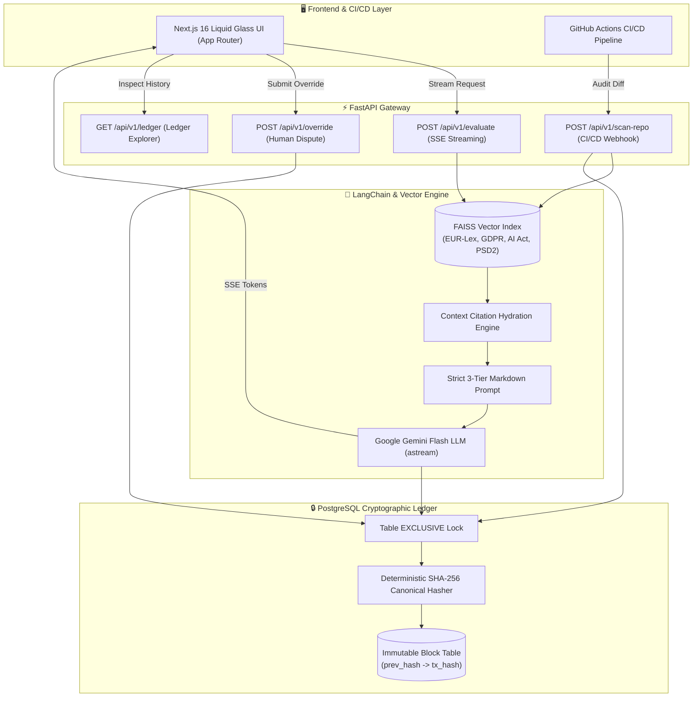

# ⚖️ FinSight — AI-Powered RegTech Compliance Gatekeeper

[](https://fastapi.tiangolo.com)
[](https://nextjs.org)
[](https://python.langchain.com)
[](https://aistudio.google.com)
[](https://www.postgresql.org)
[](https://www.docker.com)
[](#-license--copyright)

**FinSight** is an enterprise-grade Regulatory Technology (RegTech) platform and automated compliance gatekeeper. It cross-references fintech software architectures, data flows, and machine learning deployments against regional regulatory frameworks (**EU AI Act 2024/1689**, **GDPR 2016/679**, **PSD2 2015/2366**, **UK DPA 2018**, and **US CCPA/CPRA**), sealing every audit determination into an immutable, cryptographic SHA-256 PostgreSQL ledger.

---

## 🏛️ Key Capabilities

* **⚡ Real-Time SSE Streaming**: Token-by-token streaming of executive legal analyses via Server-Sent Events (SSE), delivering immediate Time-To-First-Token (TTFT).
* **🎯 Multi-Jurisdictional FAISS RAG**: Semantic vector retrieval with metadata filtering (`jurisdictions: ["EU", "UK", "US"]`) ensuring cross-regional legal accuracy.
* **🔒 Immutable SHA-256 Hash Chain Ledger**: Every compliance assessment is cryptographically linked to the previous transaction hash (`prev_hash`) in PostgreSQL with deterministic canonical serialization.
* **🧑‍⚖️ Human-in-the-Loop Dispute Protocol**: Engineers can dispute high-risk AI determinations by appending an immutable override block (`OVERRIDDEN_BY_HUMAN`) without breaking hash-chain continuity.
* **🚀 DevSecOps CI/CD Gatekeeper Webhook**: Dedicated `POST /api/v1/scan-repo` endpoint for GitHub Actions that returns HTTP 200 for compliant architectures and HTTP 403 to block non-compliant PR merges.
* **✨ Apple Liquid Glass UI**: Dark-mode dashboard built with **Next.js 16 (App Router)**, **Tailwind CSS**, and **ReactMarkdown** with native Streams API consumption.

---

## 🏗️ Architecture & Data Flow



---

## 📂 Monorepo Structure

```text
FinSight/
├── .github/
│   └── workflows/
│       └── compliance-gate.yml      # GitHub Actions automated PR compliance gate
├── backend/
│   ├── data/
│   │   ├── faiss_index/             # Pre-built FAISS vector index (index.faiss, index.pkl)
│   │   └── raw_pdfs/                # EU AI Act, GDPR, and PSD2 source regulations
│   ├── src/
│   │   ├── api/
│   │   │   ├── main.py              # FastAPI app definition, CORS, lifespan hooks
│   │   │   └── routes.py            # SSE evaluation, dispute override, and CI/CD routes
│   │   ├── core/
│   │   │   ├── database.py          # Threaded connection pooling & PostgreSQL DDL
│   │   │   ├── ledger.py            # SHA-256 hash chaining, verification, & dispute logic
│   │   │   ├── llm.py               # Singleton Gemini Flash LLM client
│   │   │   └── rag.py               # Asynchronous streaming RAG & context hydration
│   │   └── ingestion/
│   │       └── build_index.py       # PDF ingestion & FAISS embedding generation script
│   ├── Dockerfile                   # Python 3.13 + CPU-only PyTorch container
│   └── requirements.txt             # Backend dependencies
├── frontend/
│   ├── app/
│   │   ├── globals.css              # Tailwind CSS imports and typography plugins
│   │   ├── layout.tsx               # Root Next.js layout and metadata
│   │   └── page.tsx                 # Single-column Apple Liquid Glass streaming dashboard
│   ├── Dockerfile                   # Node.js 20 container definition
│   ├── package.json                 # Next.js 16, React 19, ReactMarkdown dependencies
│   └── tsconfig.json                # Strict TypeScript configuration
├── .env.example                     # Environment configuration template
├── .gitignore                       # Production git ignore configuration
└── docker-compose.yml               # Multi-container orchestration (DB, API, Frontend)
```

---

## 🚀 Quickstart Guide

### Prerequisites

* [Docker Desktop](https://www.docker.com/products/docker-desktop/) (Docker Compose v2+)
* [Google Gemini API Key](https://aistudio.google.com/)

---

### Option 1: One-Click Launch with Docker Compose (Recommended)

1. **Clone the Repository**:
   ```bash
   git clone https://github.com/your-username/FinSight.git
   cd FinSight
   ```

2. **Configure Environment Variables**:
   Create a `.env` file in the root workspace (or copy `.env.example`):
   ```bash
   cp .env.example .env
   ```
   Add your Google Gemini API key:
   ```env
   GOOGLE_API_KEY=your_actual_gemini_api_key
   GEMINI_MODEL=gemini-3.6-flash
   POSTGRES_DB=finsight_db
   POSTGRES_USER=postgres
   POSTGRES_PASSWORD=postgres
   POSTGRES_HOST=db
   POSTGRES_PORT=5432
   NEXT_PUBLIC_API_URL=http://localhost:8000
   ```

3. **Start All Services**:
   ```bash
   docker compose up --build
   ```

4. **Access the Applications**:
   * 🖥️ **Compliance Dashboard**: [http://localhost:3000](http://localhost:3000)
   * ⚡ **FastAPI Swagger API Docs**: [http://localhost:8000/docs](http://localhost:8000/docs)
   * 🗄️ **PostgreSQL Database**: `localhost:5432`

---

### Option 2: Local Development Setup (Manual)

#### 1. Start PostgreSQL
```bash
docker run -d --name finsight_postgres \
  -e POSTGRES_DB=finsight_db \
  -e POSTGRES_USER=postgres \
  -e POSTGRES_PASSWORD=postgres \
  -p 5432:5432 postgres:16-alpine
```

#### 2. Start the FastAPI Backend
```bash
cd backend
python -m venv .venv
source .venv/bin/activate  # On Windows: .venv\Scripts\activate

# Install dependencies (CPU-only PyTorch first)
pip install torch --index-url https://download.pytorch.org/whl/cpu
pip install -r requirements.txt

# Start backend server
uvicorn api:app --host 0.0.0.0 --port 8000 --reload
```

#### 3. Start the Next.js Frontend
```bash
cd frontend
npm install
npm run dev
```

Open [http://localhost:3000](http://localhost:3000) in your browser.

---

## 📡 RESTful API Reference

### 1. `POST /api/v1/evaluate` — Stream Compliance Assessment (SSE)
Executes real-time RAG evaluation against the FAISS vector database and commits the resulting assessment to the PostgreSQL ledger.

* **Request Body**:
  ```json
  {
    "query": "We are developing a cloud-hosted biometric facial recognition gateway to categorize retail banking users and authorize high-value payments automatically.",
    "jurisdictions": ["EU (AI Act, GDPR, PSD2)"]
  }
  ```
* **Response**: `text/event-stream` delivering incremental tokens:
  ```text
  data: {"type": "start", "jurisdictions": ["EU (AI Act, GDPR, PSD2)"], "citations": [...]}

  data: {"type": "token", "content": "### 🚨 Risk Classification\n* **EU AI Act**: Prohibited..."}

  data: {"type": "done", "audit_id": "7b8f9e...", "tx_hash": "a1b2c3...", "prev_hash": "0000...", "is_compliant": false}
  ```

---

### 2. `POST /api/v1/override` — Human-in-the-Loop Dispute
Appends a new dispute override record linked to the latest `tx_hash` in the hash chain without mutating or deleting existing blocks.

* **Request Body**:
  ```json
  {
    "audit_id": "7b8f9e...",
    "justification": "Biometric processing is strictly localized on-device with zero cloud telemetry under GDPR Art. 9(2)(a) explicit consent."
  }
  ```
* **Response**:
  ```json
  {
    "audit_id": "8c9a1b...",
    "original_audit_id": "7b8f9e...",
    "status": "OVERRIDDEN_BY_HUMAN",
    "prev_hash": "a1b2c3...",
    "tx_hash": "d4e5f6...",
    "timestamp": "2026-08-22T02:00:00Z"
  }
  ```

---

### 3. `GET /api/v1/ledger` — Inspect Ledger Blocks & Verify Integrity
Fetches the 10 most recent blocks and executes a full end-to-end cryptographic verification of the SHA-256 chain.

* **Response**:
  ```json
  {
    "total": 10,
    "chain_valid": true,
    "total_blocks_verified": 42,
    "verification_error": null,
    "blocks": [
      {
        "audit_id": "8c9a1b...",
        "user_query": "...",
        "prev_hash": "a1b2c3...",
        "tx_hash": "d4e5f6...",
        "timestamp": "2026-08-22T02:00:00Z"
      }
    ]
  }
  ```

---

### 4. `POST /api/v1/scan-repo` — CI/CD Automated Webhook
Acts as a compliance gate in GitHub Actions. Evaluates pull request diffs and returns HTTP 200 for compliant proposals or HTTP 403 to block PR merging.

* **Request Body**:
  ```json
  {
    "repo_name": "fintech-corp/payments-service",
    "commit_hash": "9f8a3c2b1d0e4f5a6b7c8d9e0f1a2b3c4d5e6f7a",
    "architecture_changes": "Added automated facial biometrics for user credit profiling."
  }
  ```
* **Status Codes**:
  * `200 OK`: Architecture is compliant. CI/CD build approved.
  * `403 FORBIDDEN`: Architecture violates regional regulations (Prohibited / High-Risk). CI/CD build blocked.

---

## 📚 Building Custom Regulatory Indexes

To ingest additional regulatory acts or national laws into the FAISS vector index:

1. Place your target `.pdf` documents in `backend/data/raw_pdfs/`.
2. Run the ingestion pipeline:
   ```bash
   cd backend
   python src/ingestion/build_index.py
   ```
3. The script processes chunks, extracts metadata, and updates `backend/data/faiss_index/index.faiss`.

---

## 🛡️ Security & Privacy

* **Zero Cloud Data Leakage**: Vector embeddings run locally via `sentence-transformers/all-MiniLM-L6-v2` on CPU.
* **Deterministic Hashing**: Canonical serialization ensures SHA-256 hashes are immutable against JSON key ordering discrepancies.
* **No Database Overwrites**: The compliance ledger is append-only (`INSERT` only), enforcing complete non-repudiation for financial audits.

---

## 📜 License & Copyright

**Copyright © 2026. All Rights Reserved.**

This repository, source code, architecture, and associated documentation are **Proprietary and Confidential**.

* **Permitted Use**: You are granted permission to view and examine this source code for personal review, evaluation, and educational demonstration purposes only.
* **Prohibited Use**: No part of this codebase may be copied, modified, redistributed, commercialized, sublicensed, or used in production systems without explicit, prior written permission from the copyright owner.
